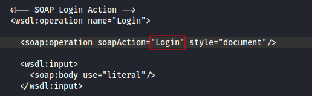

# Recursive Fuzzing

In this lab we just have to apply pretty much what we've learned in this section



```shell
ffuf -w /opt/useful/SecLists/Discovery/Web-Content/directory-list-2.3-small.txt:FUZZ -u http://94.237.49.182:57951/FUZZ -recursion -recursion-depth 1 -e .php -v
```


After we ran the tool we were able to find the page with the flag we are looking for.

<figure><figcaption></figcaption></figure>

<figure><figcaption></figcaption></figure>

Just paste the full URL on the web browser, ant that's it for this lab!
