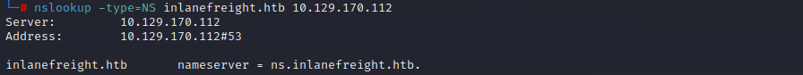

# Active Subdomain Enumeration

Submit the FQDN of the nameserver for the "inlanefreight.htb" domain as the answer.

To answer this question we’ll use the tool gobuster. First we create a txt file for our pattern, and then a second file using a wordlist by SecList to enumerate subdomains.

<figure><figcaption></figcaption></figure>

```bash
export TARGET="inlanefreight.htb" 
export NS="10.129.42.195" 
export WORDLIST="subdomains.txt" 
gobuster dns -r "${NS}" -d "${TARGET}" -w "${WORDLIST}" -p ./pattern.txt -o "gobuster_${TARGET}.txt"
```

<figure><figcaption></figcaption></figure>

With our command we were able to enumerate several FQDNs. The first one `ns.inlanefreight.htb` is the answer.

A simpler way (I found later) is just use the nslookup command `nslookup -type=NS inlanefreight.htb 10.129.170.112`

<figure><figcaption></figcaption></figure>

Identify how many zones exist on the target nameserver. Submit the number of found zones as the answer.

To this command work properly we have to add our target IP and inlanefreight.htb to the /etc/hosts

<figure><figcaption></figcaption></figure>

Given the output we got two zones (2), inlanefreight.htb and root.inlanefreight.htb

Find and submit the contents of the TXT record as the answer.

I don’t if is there any faster way to retrieve this information, but we have to use the following syntax `nslookup -query=TXT`_`subdomain.domain.htb`` ``dnsserver`_

```bash
nslookup -query=TXT ftp.admin.inlanefreight.htb 10.129.170.112
nslookup -query=TXT careers.inlanefreight.htb 10.129.170.112
nslookup -query=TXT dc1.inlanefreight.htb 10.129.170.112
nslookup -query=TXT dc2.inlanefreight.htb 10.129.170.112
nslookup -query=TXT internal.inlanefreight.htb 10.129.170.112
nslookup -query=TXT admin.internal.inlanefreight.htb 10.129.170.112
nslookup -query=TXT wsus.internal.inlanefreight.htb 10.129.170.112
nslookup -query=TXT ir.inlanefreight.htb 10.129.170.112
nslookup -query=TXT dev.ir.inlanefreight.htb 10.129.170.112
nslookup -query=TXT ns.inlanefreight.htb 10.129.170.112
nslookup -query=TXT resources.inlanefreight.htb 10.129.170.112
nslookup -query=TXT securemessaging.inlanefreight.htb 10.129.170.112
nslookup -query=TXT test1.inlanefreight.htb 10.129.170.112
nslookup -query=TXT us.inlanefreight.htb 10.129.170.112
nslookup -query=TXT cluster14.us.inlanefreight.htb 10.129.170.112
nslookup -query=TXT messagecenter.us.inlanefreight.htb 10.129.170.112
nslookup -query=TXT ww02.inlanefreight.htb 10.129.170.112 
nslookup -query=TXT www1.inlanefreight.htb 10.129.170.112
```

<figure><figcaption></figcaption></figure>

And we got our flag for the internal.inlanefreight.htb TXT record.

What is the FQDN of the IP address 10.10.34.136?

This question is not very clear, and it can lead to several interpretations. But for my understanding it’s asking us to lookup the previous subdomain (internal.inlanefreight.htb) pointer.

So we’ll use the command `dig axfr internal.inlanefreight.htb @10.129.170.112`

<figure><figcaption></figcaption></figure>

We can see the FQDN of the IP address 10.10.34.136 is `ns2.internal.inlanefreight.htb`

What FQDN is assigned to the IP address 10.10.1.5? Submit the FQDN as the answer.

Using the previous output we can see the FQDN is `dc3.internal.inlanefreight.htb`

Which IP address is assigned to the "us.inlanefreight.htb" subdomain. Submit the IP address as the answer.

We have use the same command used on the second question `nslookup -type=ANY -query=AXFR inlanefreight.htb 10.129.170.112`

<figure><figcaption></figcaption></figure>

There it is. 10.10.200.5

Submit the number of all "A" records from all zones as the answer.

To answer this command we just have to use the command `dig axfr inlanefreight.htb @10.129.170.112` and `dig axfr interna.inlanefreight.htb @10.129.170.112` and count all the “A” records.

<figure><figcaption></figcaption></figure>

<figure><figcaption></figcaption></figure>

If you found all “A” records for all zones, and don’t feel to count it like me. You can use this command to simplify:

```bash
dig axfr inlanefreight.htb @10.129.170.112 | grep -i '.htb' | grep -v -e 'SOA' -e 'NS' -e 'TXT' -e ';' -c
dig axfr internal.inlanefreight.htb @10.129.170.112 | grep -i '.htb' | grep -v -e 'SOA' -e 'NS' -e 'TXT' -e ';' -c
```

<figure><figcaption></figcaption></figure>

And If we sum it the answer we are looking for is 27!
