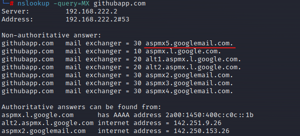
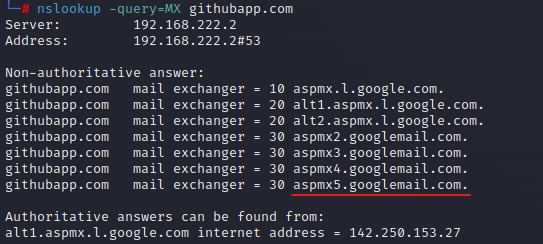
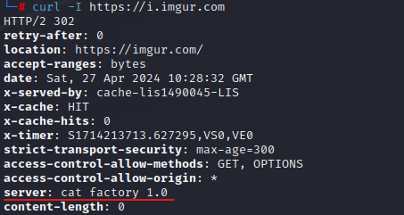

# Information Gathering - Web - Skills Assessment

Perform passive and active information gathering against this domain and answer the questions below to complete the skills assessment and finish this module.

#### **What is the registrar IANA ID number for the** [**githubapp.com**](http://githubapp.com/) **domain?**

We can retrieve de IANA ID number by doing a WHOIS lookup with the command `whois githubapp.com`

Or we can use `whois githubapp.com | grep -i iana` easily find the IANA ID 292

<figure><figcaption></figcaption></figure>

#### **What is the last mailserver returned when querying the MX records for** [**githubapp.com**](http://githubapp.com/)**?**

To answer this question we just have to issue the command `nslookup -query=MX githubapp.com`

The correct answer is `aspmx5.googlemail.com`. However, for some reason the output may vary sometimes and lead to different interpertations

<figure><figcaption><p>First try</p></figcaption></figure>

<figure><figcaption><p>Second time</p></figcaption></figure>

#### **Perform active infrastructure identification against the host**[**https://i.imgur.com**](https://i.imgur.com)**. What server name is returned for the host?**

With the command `curl -I <https://i.imgur.com`> we can display the https headers of the target webserver:

<figure><figcaption></figcaption></figure>

#### **Perform subdomain enumeration against the target** [**githubapp.com**](http://githubapp.com/)**. Which subdomain has the word 'triage' in the name?**

For the last assessment we will the tool [crt.sh](http://crt.sh).

We can easily lookup for the target on [https://crt.sh/](https://crt.sh/) but lets use some commands instead:

```javascript
export TARGET="githubapp.com"
curl -s "https://crt.sh/?q=${TARGET}&output=json" | jq -r '.[] | "\(.name_value)\n\(.common_name)"' | sort -u > "${TARGET}_crt.sh.txt"
```

After we run this commands we just grep for the ‘triage’ word:

<figure><figcaption></figcaption></figure>

And with that we found the subdomain _data-triage-reports.githubapp.com._
