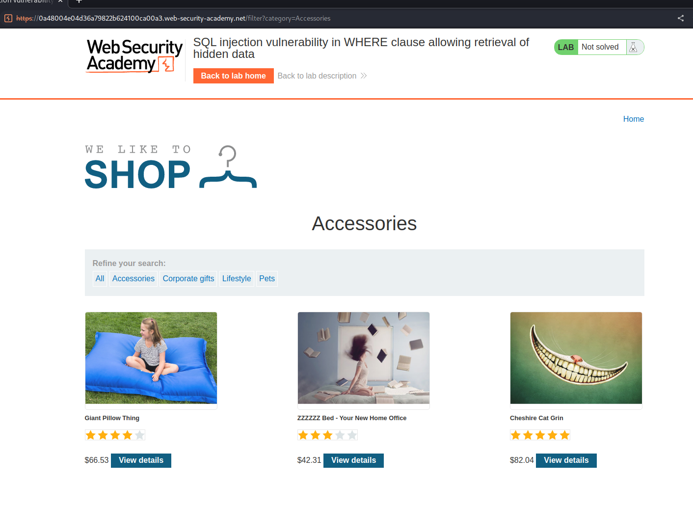
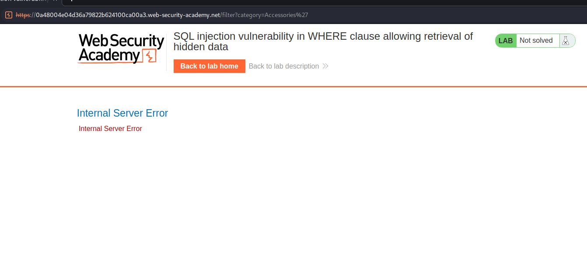
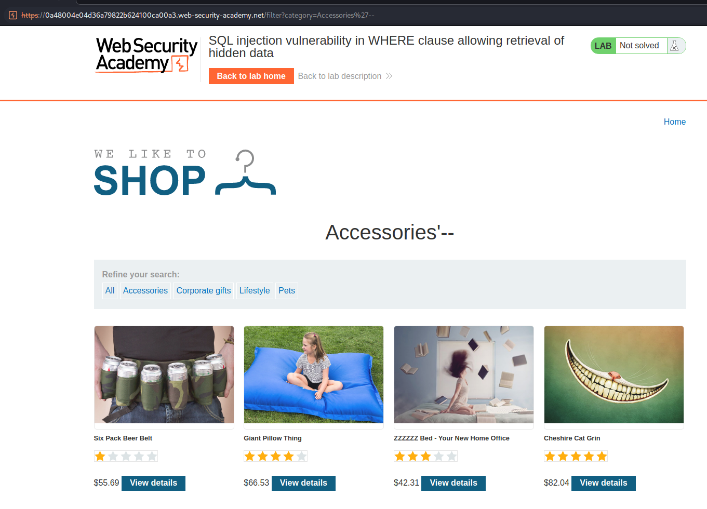
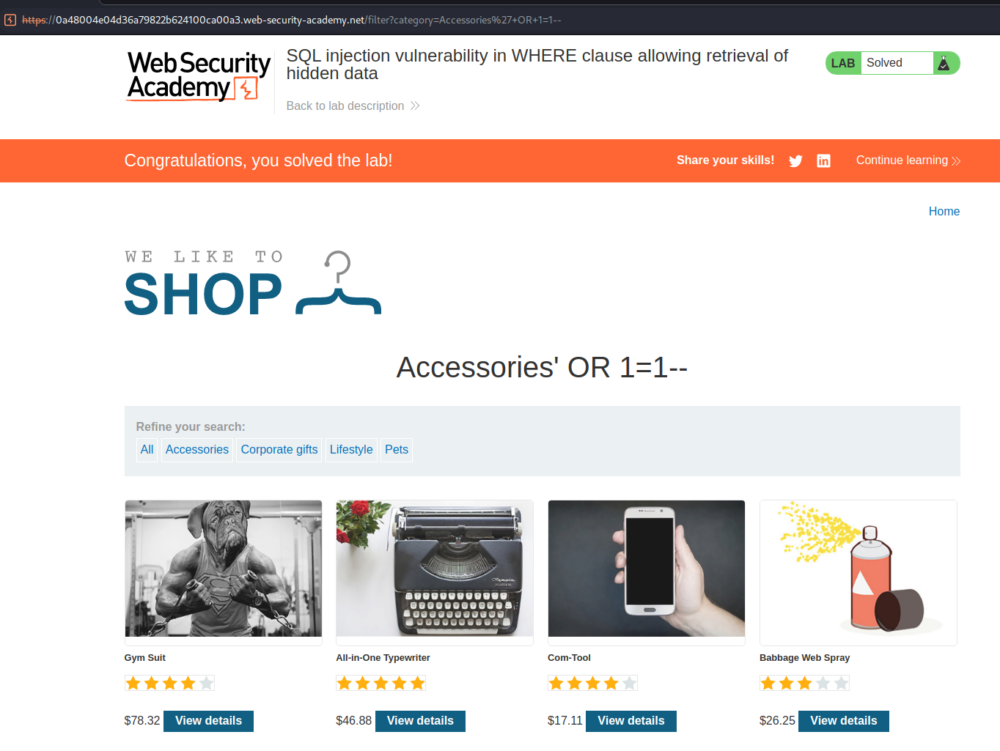

# Lab: SQL injection vulnerability in WHERE clause allowing retrieval of hidden data

This application has SQL vulnerability in the product category filter.

<figure><figcaption></figcaption></figure>

<figure><figcaption></figcaption></figure>

We choose the Accessories filter and it displays 3 products.

<figure><figcaption></figcaption></figure>

When trying to exploit the application we added an single quote at the end (’) at the end of the URL and the application returned an error.

<figure><figcaption></figcaption></figure>

If we add two dashes (- -) the application returns with a 200 OK Response. Now the application returns 4 products

<figure><figcaption></figcaption></figure>

We can assume that the query is like this `SELECT * FROM products WHERE category = 'Accessories' AND released = 1`

To display the unreleased products we added the following `' OR 1=1--` and we successfully displayed all products
